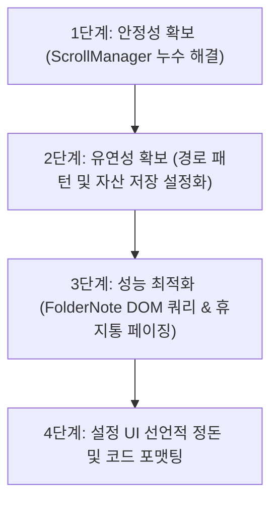

# All-in-One Toolkit 플러그인 리팩토링 계획서 (Refactoring Plan)

이 문서는 `src/` 디렉토리 내의 플러그인 소스 코드를 전반적으로 분석하고, Obsidian 커뮤니티 가이드라인 및 프로젝트 규칙("Simple is the best", "src/ejs 수정 금지")을 준수하며 코드의 유지보수성, 유연성, 성능을 극대화하기 위한 리팩토링 로드맵을 기술합니다.

---

## 1. 개요 및 목적

본 리팩토링의 핵심 목표는 다음과 같습니다.

1. **리소스 누수 방지**: 플러그인 활성/비활성화 시 이벤트 리스너가 확실하게 해제되도록 보장합니다.
2. **설정 유연성 확보**: 하드코딩된 파일 경로 패턴 및 자산 저장 경로를 설정 탭을 통해 커스텀 가능하도록 이관합니다.
3. **대용량 성능 최적화**: 대용량 Vault 환경을 고려하여 파일 탐색기 DOM 감시 연산 및 휴지통 모달 렌더링 성능을 개선합니다.
4. **코드 구조 정돈 및 타입 안전성**: 명령형 UI 구성 코드를 개선하고 타입 캐스팅 Hack을 최소화합니다.

---

## 2. 컴포넌트별 현 상태 분석 및 개선 과제

### 2.1 [main.ts](file:///home/user/workspace/obsidian-periodic-command/src/main.ts) & [settings.ts](file:///home/user/workspace/obsidian-periodic-command/src/settings.ts)

- **현 상태**:
  - `settings.ts` 내에 선언된 `getSettingDefinitions()` 메서드는 실제로 사용되지 않으며, `display()` 메서드가 매우 길고 명령형(Imperative) 방식으로 UI 요소를 직접 구성하고 있습니다.
  - `loadSettings()` 함수 내부에서 레거시 필드(`quality` -> `webpQuality`, `defaultCreateExtension` -> `folderNoteExtension`) 마이그레이션이 매번 인라인으로 발생하여 가독성을 저해합니다.
- **개선 과제**:
  - 사용하지 않는 `getSettingDefinitions()` 코드를 제거하거나, 이를 기반으로 UI를 빌드하는 방식으로 코드를 일원화합니다.
  - EJS 템플릿 룰 설정 관리 UI(`renderRules`) 부분을 독립된 클래스나 함수로 모듈화하여 `settings.ts`의 파일 크기를 슬림하게 유지합니다.
  - 설정 마이그레이션 로직을 `src/utils/settings-migrator.ts`와 같이 전용 유틸리티로 분리합니다.

### 2.2 [managers/scroll-manager.ts](file:///home/user/workspace/obsidian-periodic-command/src/managers/scroll-manager.ts)

- **현 상태**:
  - `onload()` 시 `window` 및 `WorkspaceWindow` 오픈 이벤트에 대해 `wheel` 이벤트 리스너를 바인딩하고 있습니다.
  - 그러나 `onunload()` 내부가 완전히 비어 있어(`// Lifecycle cleanup placeholder`), 플러그인이 비활성화된 후에도 이벤트가 계속 활성화되어 **메모리 누수 및 오동작**을 유발할 수 있습니다.
- **개선 과제**:
  - `onunload()` 단계에서 등록된 모든 `wheel` 이벤트 리스너 및 윈도우 오픈 핸들러를 완벽히 `removeEventListener` 또는 Obsidian API를 통해 안전하게 해제하도록 개선합니다.

### 2.3 [managers/folder-notes.ts](file:///home/user/workspace/obsidian-periodic-command/src/managers/folder-notes.ts)

- **현 상태**:
  - 파일 탐색기(`file-explorer`) 내에서 폴더 노트를 숨기고 스타일을 주입하기 위해 `MutationObserver`를 사용하여 DOM 변경 사항을 감시합니다.
  - `refreshFolderStyles()`가 실행될 때마다 탐색기 전체 노드에 대해 `querySelectorAll('.nav-file')` 및 `querySelectorAll('.nav-folder')`를 수행하므로, 파일 수가 많은 대형 Vault에서는 성능 저하가 우려됩니다.
  - `SUPPORTED_EXTENSIONS` (`['base', 'md', 'canvas']`) 및 UI 한글 텍스트('폴더 노트 생성', '폴더 노트 제거')가 코드 내에 하드코딩되어 있습니다.
- **개선 과제**:
  - Mutation 변경분이 발생했을 때 전체 DOM을 쿼리하는 대신, 추가되거나 변경된 대상 엘리먼트 주변의 서브트리만 갱신하도록 타겟팅 로직을 최적화합니다.
  - 한국어 하드코딩 텍스트를 별도의 다국어(i18n) 번들 객체로 추출합니다.

### 2.4 [managers/periodic-notes.ts](file:///home/user/workspace/obsidian-periodic-command/src/managers/periodic-notes.ts) & [managers/image-converter.ts](file:///home/user/workspace/obsidian-periodic-command/src/managers/image-converter.ts)

- **현 상태**:
  - 주기적 노트의 저장 폴더 및 파일 패턴(`40 - Periodic/`)과 이미지 변환 결과물의 저장 경로(`assets/YYYY/`)가 코드 내에 문자열로 고정되어 있습니다.
- **개선 과제**:
  - 해당 경로 패턴을 `ToolkitSettings` 인터페이스에 추가하고, 설정 화면(`settings.ts`)에서 사용자가 수정할 수 있도록 연동 및 기본값을 지원합니다.
  - 사용자가 지정한 상대 경로가 정상적으로 Vault 내에 존재하는지 검증하는 단계를 보완합니다.

### 2.5 [managers/ejs-manager.ts](file:///home/user/workspace/obsidian-periodic-command/src/managers/ejs-manager.ts)

- **현 상태**:
  - `AppLocalStorage` 타입을 강제로 선언하여 Obsidian `App` 객체를 캐스팅(`this.plugin.app as unknown as AppLocalStorage`)한 뒤, 브라우저의 `localStorage` API에 직접 접근하여 승인된 템플릿 해시를 저장하고 있습니다. 이는 다소 위험한 타입 단언(Type Assertion)일 수 있습니다.
  - ejs 템플릿에 로컬 환경 변수(`app`, `file`, `title`, `moment`, `prompt`, `select`)를 주입할 때 주입되는 헬퍼 함수가 하드코딩되어 있어, 렌더링 컨텍스트의 유연성이 떨어집니다.
- **개선 과제**:
  - `localStorage` 접근에 대한 안전한 추상화 래퍼(`src/utils/storage.ts`)를 도입하여 결합도를 낮추고 타입 안정성을 확보합니다.
  - 주입 로컬 변수(Context Locals)의 정의 구조를 정리하고 확장 가능하게 구성합니다.
  - **중요**: `src/ejs/` 내부 코드는 수정하지 않고, `EjsManager`를 통해서만 개선 작업을 수행합니다.

### 2.6 [ui/trash-modal.ts](file:///home/user/workspace/obsidian-periodic-command/src/ui/trash-modal.ts) & [managers/trash-manager.ts](file:///home/user/workspace/obsidian-periodic-command/src/managers/trash-manager.ts)

- **현 상태**:
  - 휴지통 관리 모달은 검색 쿼리(`searchQuery`)가 변경될 때마다 휴지통 전체 아이템 목록에 대해 매번 `renderTrashItem`을 돌며 DOM 엘리먼트를 처음부터 새로 그립니다.
  - 만약 휴지통에 삭제된 파일이 수천 개 이상 있을 경우 검색 시 렉이 걸리거나 화면 갱신 지연이 발생할 수 있습니다.
- **개선 과제**:
  - 검색 필터링된 결과물에 대해 페이징(Pagination)이나 가상화 스크롤(Virtual Scrolling / Infinity Scroll) 기법을 적용하여 최초 화면에 보일 수량(예: 30개)만 렌더링하고 스크롤 시 추가 렌더링하도록 개선합니다.
  - 모달 내 한글 문자열 또한 i18n 구조로 분리할 수 있도록 준비합니다.

---

## 3. 단계별 리팩토링 실행 계획 (Roadmap)

### 1단계: 안정성 확보 및 리소스 누수 방지 (즉시 착수 가능)

- **작업 내용**:
  - `ScrollManager`의 `onunload()` 내부에 `removeEventListener` 로직 구현.
  - 플러그인 로딩 및 언로딩 시점에 모든 이벤트 리스너가 대칭적으로 등록/해제되는지 교차 검증.

### 2단계: 유연성 확보 및 설정화

- **작업 내용**:
  - `settings.ts` 및 `ToolkitSettings` 확장: 주기적 노트 경로 패턴 및 WebP 이미지 저장소 경로 설정 항목 신설.
  - `PeriodicNotesManager`와 `ImageConverterManager`가 해당 설정을 참조하도록 변경.

### 3단계: 성능 최적화 (대용량 대응)

- **작업 내용**:
  - `FolderNoteManager`의 DOM 관찰 최적화: `MutationObserver` 콜백이 변경된 최소 단위 노드만 식별하여 상태를 변경하도록 개선.
  - `TrashManagerModal`에 검색 속도 향상을 위한 디바운싱(Debouncing) 적용 및 페이징 기법 적용.

### 4단계: 설정 UI 선언적 정돈 및 가이드라인 준수 검토

- **작업 내용**:
  - 중복 혹은 미사용 코드인 `getSettingDefinitions()` 정리.
  - `pnpm run format` 및 `pnpm run lint` 실행을 통한 최종 서식 및 린트 에러 검증.
  - Obsidian 디자인 가이드라인("Simple is the best")에 맞춰 CSS 파일(`styles.css`)과 UI 요소들의 간결함 유지 확인.

---

## 4. 품질 및 린트 가이드라인

- **포맷 및 린트**: 작업 단계 완료 시마다 반드시 `pnpm run format` 및 `pnpm run lint`를 실행하여 정적 분석 오류가 없는 상태를 유지합니다.
- **하위 호환성**: 기존 데이터 포맷이 유실되지 않도록 `settings.ts` 및 `main.ts`의 로드 단계에서 안전한 Fallback 설정을 상시 유지합니다.
